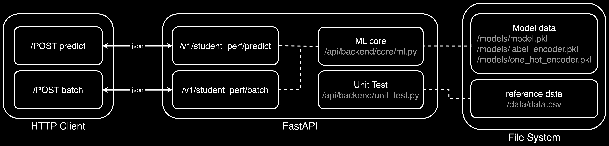
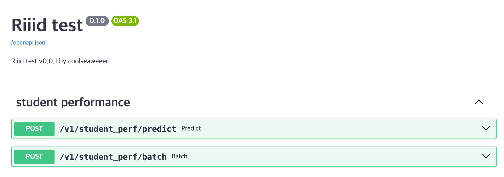

# Riiid problem 3 가이드 문서

## 1. Training
### 1-1. 학습 모델
학습에 사용된 ML모델은 `Multinomial Logistic Regression` 입니다. 모델 선정 이유는 첫번째로 데이터 유형이 **범주형(categorical) 데이터**였으며, 두번째는 **multi-class classification** 문제를 해결해야 하기 때문입니다.
### 1-2. 환경셋업
```
docker compose --profile train up -d --build 
```
### 1-3. EDA 및 학습
EDA 및 학습 과정은 [`./train/train.ipynb`](./train/train.ipynb) 파일을 통해 확인하실 수 있으며, 간단하게 아래 커맨드를 통해 모델 학습을 할수 있습니다.
```bash
docker exec riiid-p3-train-1 python train.py [--overwrite]
```
학습된 모델 weight 들은 다음과 같습니다.
```bash
./models/
├── label_encoder.pkl
├── model.pkl
└── one_hot_encoder.pkl
```
### 1-4. 성능 평가
주어진 데이터의 **30%** 를 테스트 셋으로 분리 후 학습했으며, **학습 셋**과 **테스트 셋**에 대한 정확도는 각각 **71%**, **66%** 로 측정되었습니다. 아래의 성능 평가 table 은 테스트 셋을 기준으로 나온 결과입니다.
|Adaptive Level|precision|recall|fi-score|
|:----|:---:|:---:|:----:|
|High|0.40|0.67|0.50|
|Moderate|0.67|0.66|0.66|
|Low|0.73|0.65|0.69|

## 2. Serving
### 2-1. 서빙 아키텍처


### 2-2. 환경 셋업 
```
docker compose --profile serve up -d --build 
```
### 2-3. swagger 페이지
**Default url**: `http://0.0.0.0:8080/documentation`



제공된 [`docker-compose.yaml`](./docker-compose.yaml)에서 `serve`파트를 참조하시면, `localhost`의 포트 `8080`을 통해 컨테이너에 접근가능 할 수 있도록 설정했습니다.


### 2-4. Unit Test
유닛 테스트 코드는 [`./serve/unit_test.py`](./serve/unit_test.py) 에서 확인할 수 있으며, 테스트 목표는 다음 3가지 입니다.

1. 비동기 `/predict` 동시 요청
2. `/batch` 요청
3. input 데이터 검증

아래 커맨드를 통해서 테스트 할 수 있습니다.
```bash
docker exec riiid-p3-serve-1 pytest unit_test.py
```